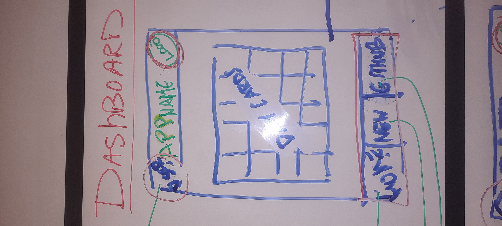

Welcome to our app.! Our goal is to make your life easier by providing you with a free app. to assist on your nutritional health journey.

We hope you enjoy using and that it helps you achieve your goals. As newbies to web development, we had a great time creating it!

The app. provides an easy way to monitor your daily calories, and the types of foods you have been eating (i.e fruit and veg.).

By automatically calculating your calorie count, based on your entered amount, as well as your target number of a certain food type.

Simply, add meals on the Dashboard (or add customized meals to the New Meal Page). Use the calendar to check your consumed meals and calorie count for any day.

<b>The Team</b>

Gavin Alexander is a talented and creative writer who loves football, from Ayr, Scotland. He will use to app. to make sure he eats enough fruit and vegetables.

Barbara Lancuba is an architect and designer originating from Buenos Aires, Argentina. She is an avid runner, tennis player, as well as a vegetarian and animal lover.

Kumar Daryanani has many years experience as a video game designer. From Barcelona, Spain, he loves testing and playing video games as well as trying cuisines from across 

# Meal Tracker App

| Pages | Route | Description | Links |
| --- | --- | --- | --- |
| Dashboard Page | / | App home page. Contains:
|   |   | Day cards, organized into a calendar month pattern. Clicking on a Day Card takes the user to that day's DayCardPage | DayCardPage
| DayCardPage | /day/:date | Daily meal tracking page. Contains:
|   |   | Daily Meal Card List - Meal cards, in column order. Each meal card consists of: delete button, image, meal name, meal calories | |
|   |   | 'Add meal' section: contains: |   |
|   |   | Scrollable single row of meal cards. These can be clicked to add them to the Daily Meal Card List |   |
|   |   | Search bar to filter meal cards. While empty, no meal cards are displayed |   |
|   |   | 'Add one-off meal' button: displays a form to enter a custom meal, with name and calorie fields, and Add button. This will add a one-off entry to the Daily Meal Card List |   |
|   |   |   |   |
| AboutPage | /about | Contains info about the team |   |
| CustomMealPage | /custom-meal | allows the user to add, edit, and delete custom meals in the app's database. Displays meal cards for all custom meals. Contains a search bar to filter custom meals |   |
| UserPage | /user | user profile page. Contains hard-coded data by default, but the user can edit it |   |

| Components | Where | Links |
| --- | --- | --- |
| Header | All pages | User button, Page Header (dynamic), App Logo button | UserPage, AboutPage |
| Footer | All pages | HomePage, CustomMealPage, Github |

| Arrays |
| --- |
| days = [(array of day objects)] |
| meals = [(array of default meal objects)] |
| customMeals = [(array of custom meals added by the user)]

| Objects |
| --- |
| User = {name, age, gender, height, weight, daily calorie target} |
| Day = {date, [array of meal objects eaten that day]} |
| Meal = {name, calories, image} |

Wireframes
==========

Presentation Link
=================

Web Deploy Link
===============
